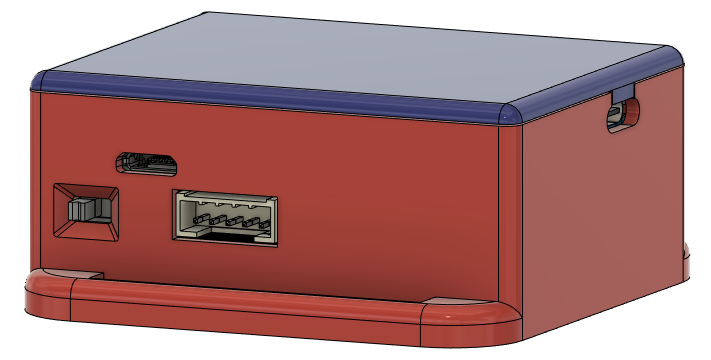
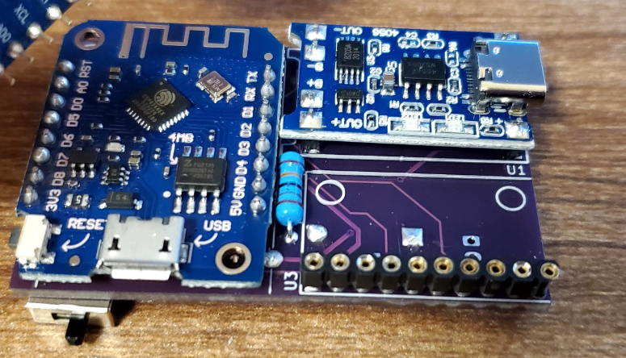
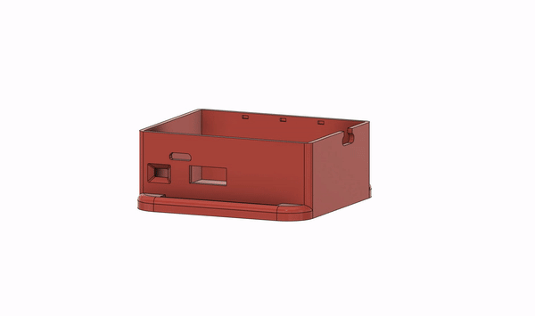

# **Butter Dish Case**  for DIY Slime VR
## The Butter Dish Case was designed to fit the [BreakoutSlime PCB](https://github.com/TheButlah/slimevr_pcb/tree/main/hardware/breakout_slime)   Designed by: [TheButlah](https://github.com/TheButlah)

All the parts were designed with FDM 3D-Printing in mind.
The case has a snap-fitting lid design that snaps into place without the need for any screws or adhesive.
The case also has a cutout for a 5 pin male JST XH connector, USB Type-C for the TP-4056 Charging module, and USB Micro Type-B for the Wemos D1 Mini.

## Index

- [Components](#Components)
- [Soldering](#Soldering)
- [Assembly](#Assembly)
- [Contributors](#Contributors)
- [Contact](#Contact)
- [License (MIT)](#License)

## Components

- [BreakoutSlime PCB](https://github.com/TheButlah/slimevr_pcb/tree/main/hardware/breakout_slime)

- TP4056 ( Type-C )

- Wemos D1 Mini

- IMU

   - BNO08X 
   - MPU6050
  
- Battery

   - 603450

- Straps

   - 38mm Elastic Straps

## Soldering

 Soldering is straight forward. Follow the standard soldering procedures, and use the headerpins to mount the components correctly so that they will be alligned with the cutouts.

## Assembly

After successfully soldering the PCB, and confirming that it's working properly, place the Battery in the case and secure it via double sided adhesive tape. Make sure to insulate the battery using electrical tape before continuing with the next step. Connect the female 2 pin JST-XH on the battery to the pcb, and secure the pcb using double sided adhesive onto the insulated battery.

## Contributors

I want to thank [TheButlah](https://github.com/TheButlah) for designing the [BreakoutSlime PCB](https://github.com/TheButlah/slimevr_pcb/tree/main/hardware/breakout_slime), and sharing it with the DIY SlimeVR community !!

## Contact

If you experience any problems or have questions/suggestions, feel free to contact me through the official SlimeVR Discord, I'm @Tom Yum#0069. If you want to help out with the project or want to make a version for a different set of hardware, you're more than welcome to send it over or do a merge request!

## License

This project is licensed under the MIT license.
